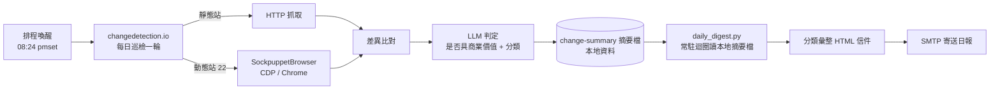

# 供應商官網變更監控與每日動態日報

> 在一台受限的公司筆電上，把「82 個供應商官網要不要天天人工看一遍」這件事，變成每天早上一封分類過的信。

**角色**：問題定義、方案選型、系統整合、部署與交接
**期間**：2026 年上半（實習期間）
**狀態**：已上線運作，並完成交接文件

---

## 問題

我所在的旅遊產品團隊需要掌握約 **82 家供應商**（票券、交通、景點）官網的異動——票價調整、檔期活動、臨時休業、動線管制。這些訊息會直接影響已經上架的商品和已排定的行程。

原本的做法是**人工不定期抽查**，實際上有三個問題：

| 問題 | 具體情況 |
|---|---|
| 覆蓋不了 | 82 個網站逐一點開，一輪至少 2 小時，實務上做不到每天 |
| 漏掉關鍵異動 | 臨時休業這類最該立刻知道的事，往往是客訴進來才發現 |
| 沒有紀錄 | 誰在什麼時候看過、看到什麼，全在個人記憶裡，無法交接 |

## 成果

- 82 個站點（含 22 個瀏覽器渲染站，其中 6 個為 Facebook 粉專）**每日自動巡檢一次**
- 每天早上一封 **依商業意義分類**的日報：`[價格] [活動] [營業異動] [交通]`
- 導入 LLM 判定，**只有具商業價值的變更才進日報**，過濾掉版位輪播、時間戳這類雜訊
- 人工巡檢時間 **約 2 小時／輪 → 0**，改為每天花 1–2 分鐘讀一封信
- 產出兩份交接文件，**非技術同事可獨立接手**維運

### 日報實際長相


> 示範資料：供應商名稱與連結已替換，版面與彙整邏輯為系統實際產出。
> 完整 HTML 範例見 [`docs/sample-digest.html`](docs/sample-digest.html)。

---

## 系統架構



四個背景服務全部以 macOS `launchd` 常駐（KeepAlive），無外部排程系統：

| 元件 | 角色 |
|---|---|
| `changedetection.io` | 監控／比對／LLM 判定（開源，見致謝） |
| `SockpuppetBrowser` | 動態站的瀏覽器渲染代理（開源，見致謝） |
| `caffeinate` agent | 巡檢時段保持機器清醒 |
| `daily_digest.py` | **本專案自行撰寫**：常駐迴圈讀本地摘要檔、分類彙整、寄出日報 |

---

## 關鍵設計決策

這一段是這個專案真正花時間的地方——每個決定背後都是一個限制。

**1. 為什麼不用 Docker？**
公司資安政策禁止在公司機安裝 Docker。改走 `uv` + venv 裸機安裝。代價是相依版本要自己鎖死，好處是不需要為了工具去申請例外。

**2. 為什麼鎖 Python 3.12 而不用機器上的 3.14？**
相依套件（lxml、pyppeteer）在 3.14 沒有預編譯 wheel，從原始碼編譯在公司機上不可行。用 `uv` 裝一份獨立的 3.12，不動系統 Python。

**3. 為什麼動態站需要額外一個瀏覽器服務？**
`changedetection` 的 Playwright fetcher 每抓完一個站就呼叫 `browser.close()`。如果接的是一個常駐 Chrome，抓完第一站瀏覽器就死了，後面 10 站全部失敗。SockpuppetBrowser 的作用是「每次連線開一個全新 Chrome、用完丟掉」，這是它無法用原生 `chrome --remote-debugging-port` 取代的根本原因。
> 這個問題是實際跑起來後才浮現的——前 1 站成功、後 10 站失敗，從 log 反推才找到原因。

**4. 為什麼不做 24 小時常駐監控？**
供應商官網的異動節奏是「天」不是「分鐘」，即時監控帶來的資訊價值增加有限，卻要付出機器不能關機的代價。改成每天早上 08:24 由 `pmset` 喚醒、巡檢完就結束。**這是一個刻意的取捨，不是能力限制。**

**5. 為什麼要加 LLM 判定？**
第一版上線後，通知量大到沒有人看——大部分變更是輪播圖、時間戳、追蹤參數。加上「是否具商業價值」的判定後，通知才變成可讀的量。
> 這是整個專案最重要的一次修正：**能偵測到變更，跟能讓人願意讀，是兩件事。**

**6. 為什麼日報改讀「變更摘要檔」而不是即時 API？**
第一版讀的是 API 回傳的最新判讀結果，但那個欄位只保留「最新一次」——白天若手動複查某個站，前一天的摘要就會被覆蓋，日報因此**整日漏報**過。修法是改讀 changedetection 每次變動都會落地的摘要檔（不會被覆蓋），並用該站的歷史快照時間序列換算出「真正的變更時間」再回填分類，而不是相信檔名上的時間戳。
> 這裡踩過一個雷：摘要檔名上的兩個時間戳指的都是「變更前那一版」，不是變更發生的時間——沒發現這點時，曾經整天漏掉七成的通知。**任何跟日期歸屬有關的邏輯，都得挑一筆已知日期的資料回頭驗證，不能只看總數合不合理。**

**7. 為什麼日報腳本後來從「排程」改成「常駐」？**
最初用 macOS 的排程（`StartCalendarInterval`）在 08:40 觸發一次性工作，結果實測時常拖到中午才寄出。原因是機器在早上多半仍在淺眠，排程到點時系統沒有真正醒著，`launchd` 會把它延後到「下一次真正喚醒」才執行——量測到最長延遲 70 分鐘。改成常駐迴圈（`KeepAlive`，每 5 分鐘檢查一次「今天該寄的寄了沒」）之後，就能利用機器每次短暫醒來的時間片段補跑，睡醒即補寄，不需要等使用者真正打開電腦。

**8. 為什麼 `daily_digest.py` 只用標準函式庫、且不存任何密碼？**
- 零外部相依 → 未來接手的人不需要維護第二套 venv
- 帳密直接從 `changedetection` 既有設定讀取 → 密碼只存在一個地方，輪替時不會漏改

**9. 為什麼分類是「價格／活動／營業異動／交通」？**
這四類直接對應團隊的四種行動：改價、更新商品頁、通知已成行訂單、調整行程動線。分類的依據是**看到之後要做什麼**，不是變更的技術類型。

---

## 交接設計

這台是公司機，日後會被重設，所以交接不能靠「傳機器」：

- **操作手冊**：給非技術接手人的日常操作、故障排除、帳戶說明
- **重建 Runbook**：在一台全新機器上從零重建的逐步流程（路徑一律用 `$HOME` 代入，不硬編使用者名稱）
- **設定備份**：一鍵打包監控設定（排除 venv 與 log）
- **服務帳戶**：通知信箱使用專用服務帳戶，2FA 採 TOTP 而非綁定個人手機，備用碼與金鑰存於單位密碼管理器 → **離職不會導致服務中斷**

---

## 技術棧

`Python 3.12` · `changedetection.io` · `Playwright / CDP` · `SockpuppetBrowser` · `launchd` · `pmset` · `SMTP / Apprise` · `LLM API`

## 致謝與說明

- 監控引擎使用開源專案 [changedetection.io](https://github.com/dgtlmoon/changedetection.io)
- 動態站渲染使用開源專案 [SockpuppetBrowser](https://github.com/dgtlmoon/sockpuppetbrowser)
- 本 repo 中的 `daily_digest.py` 為自行撰寫；程式碼撰寫過程有使用 AI 輔助，架構決策、問題定位與取捨判斷如上所述
- 本 repo 已移除公司名稱、供應商清單、內部信箱與所有憑證；供應商數量與流程為真實情況

---

## Repo 內容

```
.
├── daily_digest.py                    # 每日日報腳本（自行撰寫，僅用標準函式庫）
├── launchd/
│   └── com.example.sitemonitor.dailydigest.plist   # 排程範本
└── docs/
    ├── sample-digest.html             # 日報信件範例（示範資料）
    └── sample-digest.png              # 同上，截圖
```

監控引擎本身的設定與資料位於機器上的 `~/changedetection-data`，含供應商清單與憑證，**不納入版控**。
