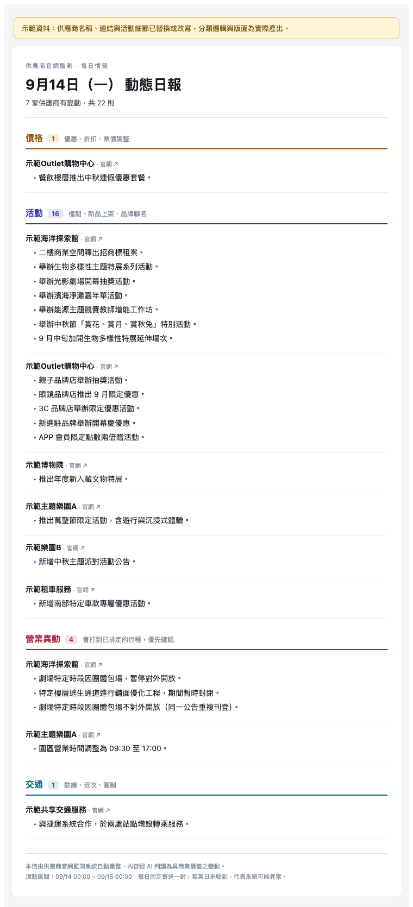
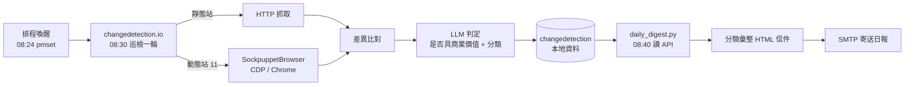

# 供應商官網變更監控與每日動態日報

> 這個project源自電商平台業務部門的需求，希望能即時掌握合作供應商的資訊。

---

## 問題

實習期間，我的主管給我一項任務，希望我優化業務部門掌握供應商資訊的流程，包括約 **80多家供應商**（票券、交通、景點）官網的異動——票價調整、檔期活動、臨時休業、動線管制。這些訊息會直接影響已經上架的商品和已排定的行程，並為後續業務及行銷部門提供行動建議。

原本的做法是**人工不定期抽查**，實際上有三個問題：

| 問題 | 具體情況 |
|---|---|
| 覆蓋不了 | 86 個網站逐一點開，一輪至少 2 小時，實務上做不到每天 |
| 漏掉關鍵異動 | 臨時休業這類最該立刻知道的事，往往是客訴進來才發現 |
| 沒有紀錄 | 誰在什麼時候看過、看到什麼，全在個人記憶裡，無法交接 |

## 成果

- 86 個站點（含 11 個 JS 動態渲染站）**每日自動巡檢一次**
- 每天早上一封 **依商業意義分類**的日報：`[價格] [活動] [營業異動] [交通]`
- 導入 LLM 判定，**只有具商業價值的變更才進日報**，過濾掉版位輪播、時間戳這類雜訊
- 人工巡檢時間 **約 2 小時／輪 → 0**，改為每天花 1–2 分鐘讀一封信
- 產出兩份交接文件，**非技術同事可獨立接手**維運

### 日報實際長相



> 示範資料：供應商名稱與連結已替換，版面與彙整邏輯為系統實際產出。
> 完整 HTML 範例見 [`docs/sample-digest.html`](docs/sample-digest.html)。

---

## 系統架構



三個背景服務常駐（macOS `launchd`），加一個排程腳本：

| 元件 | 角色 |
|---|---|
| `changedetection.io` | 監控／比對／LLM 判定（開源，見致謝） |
| `SockpuppetBrowser` | 動態站的瀏覽器渲染代理（開源，見致謝） |
| `caffeinate` agent | 巡檢時段保持機器清醒 |
| `daily_digest.py` | **本專案自行撰寫**：讀 API、分類彙整、寄出日報 |

---

## 技術棧

`Python 3.12` · `changedetection.io` · `Playwright / CDP` · `SockpuppetBrowser` · `launchd` · `pmset` · `SMTP / Apprise` · `LLM API`

## 引用框架

- 監控引擎使用開源專案 [changedetection.io](https://github.com/dgtlmoon/changedetection.io)
- 動態站渲染使用開源專案 [SockpuppetBrowser](https://github.com/dgtlmoon/sockpuppetbrowser)
- 本 repo 中的 `daily_digest.py` 為自行撰寫；程式碼撰寫過程有使用 AI 輔助，架構決策、問題定位與取捨判斷如上所述
- 本 repo 已移除公司名稱、供應商清單、內部信箱與所有憑證；供應商數量與流程為真實情況

---

## Repo 內容

```
.
├── daily_digest.py                    # 每日日報腳本（自行撰寫，僅用標準函式庫）
├── launchd/
│   └── com.example.sitemonitor.dailydigest.plist   # 排程範本
└── docs/
    ├── sample-digest.html             # 日報信件範例（示範資料）
    └── sample-digest.png              # 同上，截圖
```

監控引擎本身的設定與資料位於機器上的 `~/changedetection-data`，含供應商清單與憑證，**不納入版控**。
