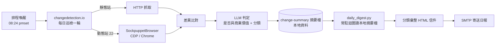

# 廠商日報系統

> 這個專案希望解決BD部門的痛點，目標是能每日掌握合作供應商的官網資訊。

---

## 情境

實習期間，我觀察到所處的BD部門對於合作供應商的最新資訊有頻繁的需求，原本的做法是**人工不定期抽查**，我歸納出幾個主要問題：

| 問題 | 具體情況 |
|---|---|
| 執行效率不佳 | 每天關注大約80多家廠商資訊不切實際，人工抽查則是覆蓋率不佳 |
| 漏掉關鍵異動 | 臨時休業這類最該立刻知道的事，往往是客訴進來才發現；或是檔期活動推出一段時間後才得知，往往錯過搶先合作的機會 |
| 沒有可靠紀錄 | 誰在什麼時候看過、看到什麼，全在個人記憶裡，無法交接 |
| 缺乏有效分類 | 廠商動態可能包含票價優惠、檔期活動、臨時休業、動線管制，不同的動態消息會有不同的策略 |

這些資訊多會影響上架商品或已排定的行程，因此我希望能有效追蹤並分類，並為後續業務及行銷部門的行動提供參考依據。

## 成果

- 每天早上自動收到廠商動態日報：並分為`[價格] [活動] [營業異動] [交通]`四大主要類別，**有效轉換為自動化流程**
- 導入 LLM 進行語意判定，**只有具商業價值的變更才寫進日報**，判定規則可隨業務需求變動。


### 日報樣式


> 示範資料：供應商名稱與連結已替換，版面與彙整邏輯為系統實際產出。
> 完整 HTML 範例見 [`docs/sample-digest.html`](docs/sample-digest.html)。

---

## 系統架構



四個背景服務全部以 macOS `launchd` 常駐（KeepAlive），無外部排程系統：

| 元件 | 角色 |
|---|---|
| `changedetection.io` | 監控／比對／LLM 判定（開源框架） |
| `SockpuppetBrowser` | 動態站的瀏覽器渲染代理（開源框架） |
| `daily_digest.py` | 常駐迴圈讀本地摘要檔、分類彙整、寄出日報 |

---


## 引用框架

- 監控引擎使用開源專案 [changedetection.io](https://github.com/dgtlmoon/changedetection.io)
- 動態站渲染使用開源專案 [SockpuppetBrowser](https://github.com/dgtlmoon/sockpuppetbrowser)
- Agentic coding [daily_digest.py]

---

## Repo 內容

```
.
├── daily_digest.py                    # 每日日報腳本（自行撰寫，僅用標準函式庫）
├── launchd/
│   └── com.example.sitemonitor.dailydigest.plist   # 排程範本
└── docs/
    ├── sample-digest.html             # 日報信件範例（示範資料）
    └── sample-digest.png              # 同上，截圖
```

監控引擎本身的設定與資料位於機器上的 `~/changedetection-data`，含供應商清單與憑證，**不納入版控**。
本專案將企業敏感資料去識別化，已移除公司名稱、供應商清單、內部信箱與所有憑證；供應商數量與流程為真實情況